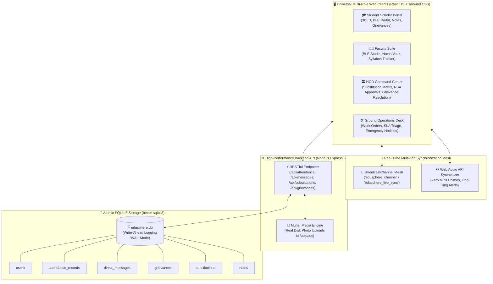

# 🎓 EduSphere — Next-Generation Smart Campus Operating System (v2.0)
🔴 **Live Demo:** https://edusphere-codeit.vercel.app/ | **Login:** `04214802722` / `student@2026` (Student) , `FAC-1092` / `faculty@pass2026` (Faculty)


[](https://react.dev/)
[](https://tailwindcss.com/)
[](https://vitejs.dev/)
[](https://www.sqlite.org/)
[](https://expressjs.com/)
[]()
[]()

> **Built for Hackathon Excellence by Team CODE it**  
> *A unified, zero-regression, paperless digital campus operating system connecting Students, Faculty, Department Heads (HOD), and Ground Staff into an ultra-fast, real-time synchronized ecosystem.*

---

## 🌟 Executive Summary & Problem Statement

Higher education institutions in India and across the globe continue to rely on fragmented, legacy ERP portals, manual paper registers, static laminated ID cards vulnerable to proxy check-ins, and chaotic WhatsApp groups where critical academic notices get lost.

| Problem in Traditional Campus Portals | 🚀 EduSphere Smart Campus OS Solution |
|---|---|
| **Proxy Attendance Frauds** (Static QR codes & shared links) | **Anti-Proxy Dual-Factor BLE Radar**: Physical Bluetooth proximity handshake (0.8m) combined with 4-digit dynamic rotating classroom PINs. |
| **Static & Counterfeit Student IDs** (Fake paper/PVC cards) | **3D Holographic Virtual ID Passes**: Physics-based 3D tilt sheen, 30-second cryptographic rotating QR code, and NFC RFID tap simulator. |
| **Chaotic & Leaky Communication** (Unfiltered global broadcast spam) | **WhatsApp-Grade 1-on-1 Direct Chat Matrix**: Thread-scoped message isolation (`[User1_User2]`), blue double-ticks, and real-time audio chimes. |
| **Fear of Retaliation in Grievances** (No student protection) | **Double-Triage Anonymous Grievance Desk**: Cryptographic privacy mask routing academic issues to HOD with **RSA-2048 Digital Seals** and repairs to Ground Staff. |
| **Sudden Faculty Absences & Class Cancellations** | **Automated AI Substitution Engine**: Ranks free teachers by department match and subject competency with 1-click reassignment. |
| **Confusing English-Only Portals** | **EduBot Multilingual AI Companion**: Context-aware natural language assistant answering campus queries in **Hinglish & English**. |

---

## 🏛️ System Architecture Flow



---

## 💎 Key Architectural Pillars & Features

### 1. 🪪 Universal 4-Role 3D Holographic Virtual ID Passes
- **Dynamic Cryptographic QR**: Level-H error-correcting QR code regenerating every 30 seconds to completely eliminate screenshot-sharing gate fraud.
- **Interactive 3D Sheen**: Cursor/touch physics engine simulating holographic security foil reflection.
- **NFC RFID Simulator**: Flip the card to test NFC gate tap verification with custom synthesized audio.
- **Formal PDF Generation**: 1-click download of official 300 DPI PVC badge layout for physical printing.

### 2. 📡 Anti-Proxy Dual-Factor BLE Attendance Engine
- **Classroom Proximity Radar**: Live Web Bluetooth RSSI telemetry scanning ensuring students are physically within the lecture hall (0.8m boundary).
- **Dynamic PIN Handshake**: Teacher's display broadcasts a rotating 4-digit code (e.g. `OS42`) that expires with the class countdown timer.
- **Period-by-Period Calendar**: Visual attendance calendar showing subject-wise attendance percentages, surplus lecture margin, and 75% statutory quota warning flags.

### 3. 💬 Ultra-Private 1-on-1 Direct Chat Matrix
- **Thread-Scoped Identity**: Every direct message is strictly hashed and isolated using `threadId = [senderId, recipientId].sort().join('_')`.
- **Zero Cross-Role Leakage**: Direct chats between a Student and Teacher never broadcast or leak onto HOD or Staff screens.
- **WhatsApp Experience**: Real-time incoming double chimes, floating toast banners, blue read receipts, and file attachment sharing.

### 4. 🏛️ HOD Automated Substitution & RSA Resolution Desk
- **Algorithmic Peer Matcher**: Evaluates free timetable periods, department alignments, and subject competencies to rank substitute teachers with a percentage score (e.g., *98% AI Match*).
- **1-Click Reassignment**: Immediately pushes updated class schedules to the designated substitute's timetable with push alerts.
- **RSA-2048 Digital Seals**: Executive resolution desk for student academic grievances attaching cryptographic verification seals (`RSA-HOD-CSE-0x...`) with permanent SQLite audit logs.

### 5. 🤖 EduBot Multilingual AI Campus Companion
- **Hinglish + English Natural Language Engine**: Built-in NLP parser resolving queries across 9 core campus domains (*"attendance kaise lagaye?"*, *"teacher ko complaint kaise kare?"*, *"AC kharab hai lab me"*).
- **Context-Aware Quick Chips**: Roaming assistant with adaptive suggestions, navigation shortcuts, and zero external API dependencies.

---

## ⚡ Quickstart Guide (Zero-Configuration Setup)

### 📋 Prerequisites
- **Node.js**: v18.0.0 or higher
- **npm**: v9.0.0 or higher

### 🚀 1-Step Installation & Run

1. **Clone the repository**:
   ```bash
   git clone https://github.com/manish/EduSphere.git
   cd EduSphere
   ```

2. **Install all dependencies**:
   ```bash
   npm install
   ```

3. **Launch the Full-Stack Application** (Concurrent Backend API + Vite Dev Server):
   ```bash
   npm run dev
   ```
   - **Frontend UI**: `http://localhost:5173`
   - **Backend REST API**: `http://localhost:5001/api`
   - **SQLite Database**: Automatically initialized with Write-Ahead Logging (`server/edusphere.db`).

---

## 👥 Demo User Credentials (1-Click Fill Available on Login)

| Role | Name | Identifier / Email | Demo Password | Unique Features |
|---|---|---|---|---|
| 🎓 **Student Scholar** | Krrish Kumar Tanti | `04214802722` | `student@2026` | 3D ID Pass, BLE Attendance Radar, Grievance Desk, Notes Vault |
| 👨‍🏫 **Faculty Member** | Dr. Manish Verma | `FAC-1092` | `faculty@pass2026` | Live BLE Studio, Notes Publisher, Syllabus Progress Tracker |
| 🏛️ **HOD Executive** | Prof. S. K. Naitik | `HOD-CSE-01` | `hod@campus2026` | Substitution Engine, RSA Approvals, Master Timetables, Academic Triage |
| 🛠️ **Operations Staff** | Rajesh Sharma | `STF-504` | `staff@ops2026` | Maintenance Dispatch, Emergency Hotline, Incident Resolution |

---

## 📂 Repository Architecture

```text
EduSphere-CODE-it-/
├── server/
│   ├── db.js                        # SQLite3 WAL schema, automatic migrations & seeds
│   ├── index.js                     # Express REST API routes & Multer uploads
│   └── edusphere.db                 # Persistent SQLite database file
├── src/
│   ├── components/
│   │   ├── Navbar.jsx               # Navigation bar with role badge & direct chat trigger
│   │   ├── DirectChatDrawer.jsx     # WhatsApp 1-on-1 chat drawer with thread isolation
│   │   ├── IncomingChatToast.jsx    # Real-time message toast popup
│   │   ├── ErrorBoundary.jsx        # Safe mode recovery wrapper
│   │   ├── SearchableSelect.jsx     # Viewport-collision aware searchable combobox
│   │   └── Chatbot/
│   │       ├── EduBot.jsx           # Multilingual AI floating widget
│   │       └── botKnowledge.js      # Hinglish + English knowledge base
│   ├── context/
│   │   ├── AuthContext.jsx          # User session, credentials verification & photo upload
│   │   └── DataContext.jsx          # Multi-tab BroadcastChannel live synchronization
│   ├── data/
│   │   ├── collegesData.js          # Universal Delhi NCR colleges & universities directory
│   │   ├── ggsipuData.js            # Departments, semesters, sections & designations
│   │   └── syllabusData.js          # Curriculum blueprints & timetable matrices
│   ├── pages/
│   │   ├── Login.jsx                # Universal 4-Role sign-in & registration portal
│   │   ├── student/                 # VirtualIDCard, AttendanceClient, GrievanceDrawer, NotesFeed
│   │   ├── teacher/                 # TakeAttendance, NotesPublisher, TeacherDashboard
│   │   ├── hod/                     # HodDashboard, SubstitutionEngine, AcademicGrievanceDesk, DigitalApprovals, Broadcasts
│   │   └── staff/                   # StaffDashboard, TicketInbox
│   ├── utils/
│   │   └── soundEffects.js          # Web Audio API procedural sound synthesizer
│   ├── App.jsx                      # Root application router with ErrorBoundary
│   ├── main.jsx                     # Vite client entry point
│   └── index.css                    # Tailwind CSS v4 frosted glassmorphism styling
├── CONTEXT.md                       # Comprehensive technical reference manual
├── Dockerfile                       # Production-ready container manifest
├── render.yaml                      # Render cloud deployment manifest
└── package.json                     # Project dependencies & npm scripts
```

---

## 🔒 Security & Privacy Engineering

- **Cryptographic Threat Isolation**: Direct messaging streams verify `currentUid` against sender/recipient before state commit. Unrelated roles never receive payloads.
- **Zero-Retaliation Student Identity Shield**: Students lodging sensitive complaints can mask their name and enrollment with a cryptographic anonymity shield.
- **RSA-2048 Verified Executive Stamps**: Approvals and resolutions issued by HOD generate dynamic verification hashes to prevent administrative tampering.
- **Atomic SQLite WAL Transactions**: Multi-tab writes operate under SQLite Write-Ahead Logging mode to guarantee ACID compliance without database lock contention.

---

## 🏆 Hackathon Team: CODE it
- **Krrish Kumar Tanti** — *System Architecture, Database Engineering & Student Experience*
- **Dr. Manish Verma / Antigravity Pro** — *Faculty Suite, HOD Substitution Engine & Real-Time Sync*
- **Prof. S. K. Naitik / Antigravity AI** — *EduBot Multilingual NLP Engine & Technical Documentation*

---

*EduSphere © 2026 • Crafted with passion for the Future of Higher Education.*
